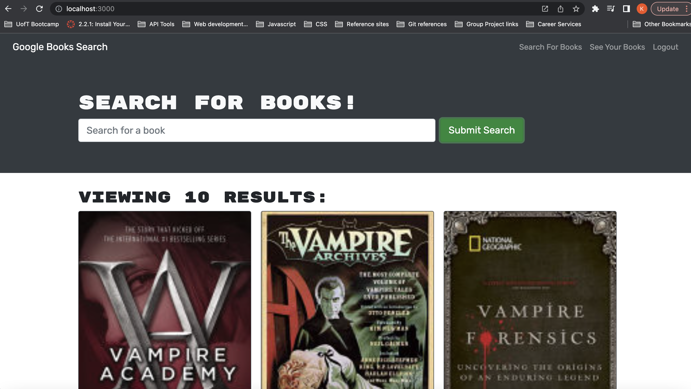

# Book Search Engine

### User Story
As a User I would like a website to search books so I can save a list to read later. When I am presented with the main page I should be able to type criteria in the search and be presented with a list of books matching that criteria. As a user I want a secure login to the site. If I am logged into the site, when I search boooks I should see an option to save the book. Then when I go to my saved books section I should see all my saved books. I should also be able to delete a book from my saved books.

### Features
This web application features a secured login for users
This web application is a book search engine that calls the googlebooks API
This web application allows users to search books
When a user is loggin in they can then save any books searched
These books will be displayed under their saved books section
Users can also delete books from this section

### badges

## Table of Contents

- [installation](#installation)
- [contribution guidelines](#contribution)
- [Test Instructions](#testing)
- [License](#license)
- [Questions](#questions)

### Installation
1. Please clone the github repo here : https://github.com/Vinyldude8896/book_search_app
2. Run npm install to install the dependecies.
3. Then at the root folder, run npm start and go to:
http://localhost:3000/#home

You can also view the deploiyed app here:  
https://book-search-utility.herokuapp.com

### Contribution Guidelines
Current contributers:
Kevin Reid : https://github.com/Vinyldude8896  

### Testing
To test this app: 
1. Clone the repo here : https://github.com/Vinyldude8896/book_search_app  
2. Install depenencies using npm istall.  
3. from the root folder run npm start  
4. Browser should open to this page: http://localhost:3000/#home  
5. Try to sign up to the site  
6. Try lgout and logging into the site  
7. Test the search by searching for books.  
8. Try adding a book from the search results.  
9. Check that saved books are in your saved boks section. 
10. Try deleting a book from your saved books section 
11. alternatively you can test the deployed app here:
    https://book-search-utility.herokuapp.com

### Questions
    email address : kevinnivek@me.com
    - additional instructions 
    I can be contacted by phone as well, but prefer email contact first.
### Images

